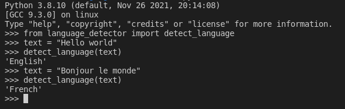

# language-detector
language-detector detects the language of text

## Python Version
Works with both Python 2 and 3

## How to use?
```
# install package
pip install language-detector

# run code
python main.py
```


